> 注：以下内容均摘抄自实验室祖传文档。本文加以排版，以供同行好友及自己方便查阅学习

**目录**
- [1、数码相机的色度特征化方法](#1数码相机的色度特征化方法)
  - [数码相机获取彩色图像的原理](#数码相机获取彩色图像的原理)
- [2、数码相机色度特性化方法](#2数码相机色度特性化方法)
  - [单阶段模型和双阶段模型](#单阶段模型和双阶段模型)
  - [多项式模型](#多项式模型)
- [3 基于多项式的自适应色度特性化模型原理及评价](#3-基于多项式的自适应色度特性化模型原理及评价)
  - [(一) 模型原理](#一-模型原理)
  - [(二) 模型评价](#二-模型评价)
    - [(1) 实验样本采集及校正](#1-实验样本采集及校正)
    - [(2) 数码相机非线性变换对色度特性化精度的影响](#2-数码相机非线性变换对色度特性化精度的影响)
    - [(3) 多项式项数及样本介质对特性化精度的影响](#3-多项式项数及样本介质对特性化精度的影响)
- [其他相关讨论](#其他相关讨论)

**正文**

数码相机作为一种重要的数字彩色图像获取设备，目前主要有两类方法用于数码相机的色度特性化，如图 3.1 所示。一类是基于色度值的方法，即通过建立数码相机的红、绿和蓝通道**驱动值**与色度值的对应关系来实现特性化；另一类是基于光谱的方法，即通过预测数码相机的光谱灵敏度曲线来实现其色度特性化。

本文分别把这两类方法称为数码相机的色度特性化和光谱特性化方法。数码相机的色度特性化方法又可以分为两种，即模型法和经验法。模型法包括两个步骤，即从拍摄对象所发出的光谱辐射强度到数码相机电荷耦合器件（CCD）响应值的变换以及数码相机 CCD 响应值到图像像素红、绿和蓝三色通道**驱动值**的变换。

在实际应用中，一般首先通过非线性函数模拟图像像素红、绿和蓝通道**驱动值**与数码相机 CCD 响应值的变换关系，然后再通过线性或非线性方法实现 CCD 响应值到 CIEXYZ 色度值的变换。经验法则直接通过数学方法，诸如多项式拟合、神经网络及三维查找表等方法实现数码相机色度特性化。

---

### 1、数码相机的色度特征化方法

#### 数码相机获取彩色图像的原理

数码相机获取彩色图像的原理如图 3.1 所示，拍摄目标对光源发出的光在不同波段选择性吸收及反射，反射光经光学系统成像及滤光片调制后在电荷耦合器件（CCD，Charge-coupled Device）或 CMOS（complementary metal oxide semiconductor）器件上成像，为了叙述方便，下文均以 CCD 表示电荷成像器件。若光源的光谱辐射强度、拍摄目标的光谱反射比、光学系统的光束传输函数、滤光片的光谱透射比及 CCD 的光谱灵敏度函数分别用 $P(\lambda)$、$\rho(\lambda)$、$\sigma(\lambda)$、$\tau_k(\lambda)$ 和 $s(\lambda)$ 表示，则 CCD 上每个像素单元的响应值 $L_k$ 可以表示为：

$$L_k = \int_{\lambda_{min}}^{\lambda_{max}} P(\lambda) \rho(\lambda) o(\lambda) \tau_k(\lambda) s(\lambda) d\lambda \quad (3.1)$$

式中，$k$ ($k=R, G, B$)表示三色通道类型, $\lambda_{min}$ 和 $\lambda_{max}$ 分别表示数码相机成像光谱范围的最小波长和最大波长。在实际应用中，经常将光束传输函数 $\sigma(\lambda)$、滤光片透射比 $\tau_k(\lambda)$ 及 CCD 的光谱灵敏度函数 $s(\lambda)$ 这三个数码相机内部参数归为一项 $w_k(\lambda)$，故式(3.1)可以简写为：

$$L_k = \int_{\lambda_{min}}^{\lambda_{max}} P(\lambda) \rho(\lambda) w_k(\lambda) d\lambda \quad (3.2)$$

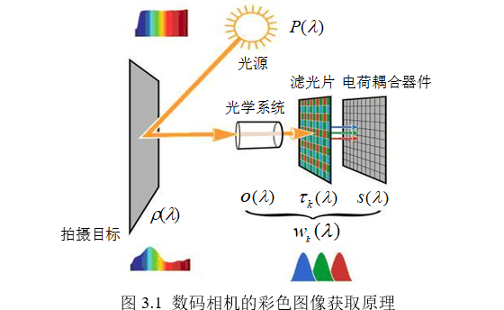

对于一部分专业数码相机，会将 CCD 每个像素的原始响应值以文件方式记录下来，这类图像称为 **Raw 图像**，然后用户可以通过专门的图像处理软件对 Raw 格式图像进行处理，得到所需要的彩色图像。

而大部分普通商用数码相机不提供 Raw 格式图像，直接对 CCD 响应值进行去除噪声、阶调转换、白平衡、彩色校正及图像压缩等复杂的处理过程后生成 JPEG、TIFF 或 BMP 等格式的彩色图像，这一处理过程可以简单地用**非线性转换函数 $f_k$ 表示**。经过上述过程变换后，最终获得的彩色图像各个像素的 R、G 和 B 通道**驱动值** $d_R$、$d_G$ 和 $d_B$ 可表示为：

$$
\begin{cases}
d_R = f_R(\int_{\lambda_{min}}^{\lambda_{max}} P(\lambda) \rho(\lambda) w_R(\lambda) d\lambda) \\
d_G = f_G(\int_{\lambda_{min}}^{\lambda_{max}} P(\lambda) \rho(\lambda) w_G(\lambda) d\lambda) \\
d_B = f_B(\int_{\lambda_{min}}^{\lambda_{max}} P(\lambda) \rho(\lambda) w_B(\lambda) d\lambda)
\end{cases}
\quad (3.3)
$$

CIE 色度系统中通过计算物体对应的 CIE1931 色度系统的三刺激值方法如式(3.4)所示。将式(3.2)、(3.3)与式(3.4)对比可以发现，Raw 格式图像每个像素响应值的计算方法和 CIEXYZ 三刺激值的计算方法很相似，区别仅在于两者的光谱灵敏度函数不同。

$$
\begin{cases}
X = k \int_{\lambda_{min}}^{\lambda_{max}} P(\lambda) \rho(\lambda) \bar{x}(\lambda) d\lambda \\
Y = k \int_{\lambda_{min}}^{\lambda_{max}} P(\lambda) \rho(\lambda) \bar{y}(\lambda) d\lambda \\
Z = k \int_{\lambda_{min}}^{\lambda_{max}} P(\lambda) \rho(\lambda) \bar{z}(\lambda) d\lambda
\end{cases}
\quad (3.4)
$$

### 2、数码相机色度特性化方法

目前主要有两类方法用于实现商用数码相机的色度特性化，一类方法是确定数码相机 CCD 响应值与**驱动值**的对应关系及数码相机 CCD 的光谱灵敏度，这样对于任意输入数码相机的已知光谱辐射强度，都可以通过式(3.3)确定其对应的驱动值，然后再建立色度值与**驱动值**的对应关系，这类方法称为数码相机的**光谱特性化**。

另一类方法则是直接建立数码相机**驱动值**与色度值的对应关系，这类方法称为数码相机的**色度特性化**。

#### 单阶段模型和双阶段模型

根据是否单独处理商用数码相机的非线性处理过程及其光谱灵敏度与标准色度观察者的不同，可以将目前用于数码相机的色度特性化方法分为两类，并分别称为数码相机色度特性化的**单阶段模型**和**双阶段模型**。

对于**双阶段模型**，首先建立数码相机非线性处理过程的模型 $f_k^{-1}$，从普通彩色图像（JPEG、TIFF、BMP 等格式）每个像素对应的 R、G 和 B 通道**驱动值** $d_R$、$d_G$ 和 $d_B$ 预测对应的 CCD 响应值，然后再建立模型预测 CCD 响应值对应的 CIEXYZ 三刺激值的对应关系。目前主要有两类方法用于建立数码相机**驱动值**与 CCD 响应值的对应关系，即亮度和光谱积分值法。

**（一）亮度或光谱积分值法**

由于很难直接获得数码相机 CCD 的真实响应值，故一般通过一系列灰色块对应的亮度值或光谱强度积分值来代替 CCD 的真实响应值以建立非线性变换模型。基于亮度值及光谱强度积分值的变换关系分别为：

$$
\begin{cases} L = f_R^{-1}(d_R) \\ L = f_G^{-1}(d_G) \\ L = f_B^{-1}(d_B) \end{cases}
\quad (3.5)
$$

和

$$
\begin{cases} S = f_R^{-1}(d_R) \\ S = f_G^{-1}(d_G) \\ S = f_B^{-1}(d_B) \end{cases}
\quad (3.6)
$$

其中

$$L = \int_{\lambda_{min}}^{\lambda_{max}} P(\lambda) \rho(\lambda) V(\lambda) d\lambda \quad (3.7)$$

$$S = \int_{\lambda_{min}}^{\lambda_{max}} P(\lambda) \rho(\lambda) d\lambda \quad (3.8)$$

式中，$\rho(\lambda)$ 表示灰色块的光谱反射比，$V(\lambda)$ 表示视觉光谱光视效率函数，$L$ 为灰色块对应的亮度，$S$ 为灰色块对应的光谱积分值。

**（二）光谱法**

光谱法是另外一种建立非线性变换模型的方法，该方法首先需要通过测量或模型预测法得到数码相机 R、G 和 B 三个通道的光谱灵敏度，然后通过式(3.2)计算其对应的 CCD 响应值。

#### 多项式模型
> 注意这个就是使用比较多的 CCM 

多项式模型被广泛用来实现数码相机的色度特性化。

其基本原理是通过多项式展开的方式建立 R、G 和 B 通道**驱动值** $d_R$、$d_G$ 和 $d_B$ **驱动值**和 CIEXYZ 三刺激值或 CIE1976 L\*a\*b\*颜色空间色坐标值的对应关系。以 $d_R$、$d_G$ 和 $d_B$ **驱动值**到 XYZ 的变换为例，多项式模型可以表示为：

$$T_{j,i} = a_{i,1} + a_{i,2}r_j + a_{i,3}g_j + a_{i,4}b_j + a_{i,5}r_j^2 + a_{i,6}g_j^2 + a_{i,7}b_j^2 + a_{i,8}r_j g_j + ... \quad (3.9)$$

式中，$T_{j,i}$ 表示第 j ($j=1, 2, ..., n$, n 为样本个数)个颜色样本对应的 i ($i=X, Y, Z$)刺激值，$a_{t,i}$ ($t=1, 2, ..., m$, m 为多项式项数)表示 i 刺激值对应的多项式系数，$r_j$、$g_j$ 和 $b_j$ 分别表示第 j 个颜色样本对应的 R、G 和 B 通道归一化驱动值，即：

$$
\begin{cases} r_j = \frac{d_{j,R}}{255} \\ g_j = \frac{d_{j,G}}{255} \\ b_j = \frac{d_{j,B}}{255} \end{cases}
\quad (3.10)
$$

这样所有颜色样本对应的式(3.9)可以用矩阵形式简单地表示为：

$$\mathbf{H} = \mathbf{W} \mathbf{M} \quad (3.11)$$

其中

$$
\mathbf{H} = \begin{bmatrix} X_1, Y_1, Z_1 \\ X_2, Y_2, Z_2 \\ \vdots \\ X_n, Y_n, Z_n \end{bmatrix}
\quad (3.12)
$$

$$
\mathbf{M} = \begin{bmatrix} a_{1,1}, a_{1,2}, a_{1,3} \\ a_{2,1}, a_{2,2}, a_{2,3} \\ \vdots \\ a_{m,1}, a_{m,2}, a_{m,3} \end{bmatrix}
\quad (3.13)
$$

式中，$\mathbf{H}$ 表示由所有颜色样本对应三刺激值构成的 $n \times 3$ 矩阵，$\mathbf{M}$ 为待求的 $m \times 3$ 多项式**系数矩阵**，$\mathbf{W}$ 是由所有样本的归一化**驱动值**对应的多项式扩展项构成的 $n \times m$ 输入矩阵，$\mathbf{W}$ 的行向量可以在下式的 $\mu_m$ 中选取：

> M是系数矩阵，也就说第一列为X的系数，以此类推；
> W是rgb，即驱动值，也即从sensor读取的，CCM校正之前的数据。 这里将他拓展是为了更加精确地拟合RGB到XYZ之间的非线性关系的

$$
\begin{cases}
\mathbf{\mu}_3 = [r_j \quad g_j \quad b_j] \\
\mathbf{\mu}_4 = [1 \quad r_j \quad g_j \quad b_j] \\
\mathbf{\mu}_5 = [1 \quad r_j \quad g_j \quad b_j \quad r_j g_j b_j] \\
\mathbf{\mu}_8 = [1 \quad r_j \quad g_j \quad b_j \quad r_j^2 \quad g_j^2 \quad b_j^2 \quad r_j g_j b_j] \\
\mathbf{\mu}_{11} = [1 \quad r_j \quad g_j \quad b_j \quad r_j g_j \quad r_j b_j \quad g_j b_j \quad r_j^2 \quad g_j^2 \quad b_j^2 \quad r_j g_j b_j] \\
\quad \vdots
\end{cases}
\quad (3.14)
$$

> 常见的CCM一般就是取 $\mu_3$, 也就是说是3*3的矩阵

从理论上讲，$\mathbf{W}$ 的行向量可以取任意项的组合及任意多的项数，但实际上多项式模型的不同项及项数对模型的颜色预测精度有较大影响，应根据实际需求选择合适的项及项数。

通过训练样本得到式(3.11)后，即可基于最小二乘法确定多项式的系数矩阵 $\mathbf{M}$：

$$\mathbf{M} = (\mathbf{W}^T \mathbf{W})^{-1} \mathbf{W}^T \mathbf{H} \quad (3.15)$$

式中，“T”表示矩阵转置，“-1”表示矩阵求逆。

当然可以。我已经将您新上传的这部分内容也整理成了 Markdown 格式。

---

### 3 基于多项式的自适应色度特性化模型原理及评价

上述多项式模型整个空间仅用一组多项式表示 R、G 和 B 通道**驱动值** $d_R$、$d_G$ 和 $d_B$ 与 CIEXYZ 三刺激值的转换关系，但对大部分数字图像设备而言，不同的**驱动值**子空间中 $d_R$、$d_G$ 和 $d_B$ **驱动值**与三刺激值的对应关系并不相同，因此有人提出用分空间的方式实现数字图像设备的色度特性化。因此，本研究提出了基于多项式的自适应色度特性化模型。

#### (一) 模型原理

自适应色度特性化模型也采用分空间的思想，但不采取用固定分界面划分空间的方法，而是根据样品点**驱动值**动态地选取训练样本来实现数码相机的色度特性化。对于 $d_R$、$d_G$ 和 $d_B$ **驱动值**到 CIEXYZ 三刺激值的变换，首先分别计算测试样品点 $d_R$、$d_G$ 和 $d_B$ **驱动值**与所有训练样本 $d_R$、$d_G$ 和 $d_B$ **驱动值**之间的欧几里德距离，然后按照从小到大的顺序，选取前 `1` 个样本作为该测试样品点对应的训练样本，再采用合适的多项式模型预测该测试样品的对应的三刺激值。由于对于每个样品点，其训练样本的选择是一个动态过程，避免了固定分界面模型中出现的分界面附近样品点模型预测值相差很大的现象。

#### (二) 模型评价

一般的色度特性化模型需要一定数量的色样作为训练样本以获得模型参数，还应有一定数量的色样对模型的预测精度进行评价。

##### (1) 实验样本采集及校正

GretagMacbeth 公司的 ColorChecker DC Chart (CCDC) 和 ColorChecker Color Rendition Chart (CCRC) 被广泛用于数字图像获取设备的色度特性化，如图 3.2 所示。

其中 CCDC 标准色卡由五部分组成，包括位于色卡四周的 60 个黑、灰和白色块、156 个非光泽彩色块、8 个光泽彩色块、12 个灰色块及位于色卡中心的 4 个白色块CCRC 色卡由 6 个灰色块和 18 个彩色块组成。

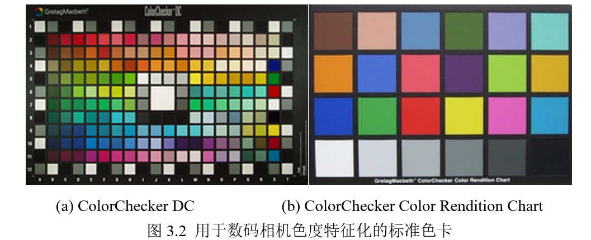

为了获得稳定的照明环境，条件如图 3.3 所示，设计了专用的 45° 支架并将灯箱底部完全用所有被摄对象都放在支架上进行拍摄。

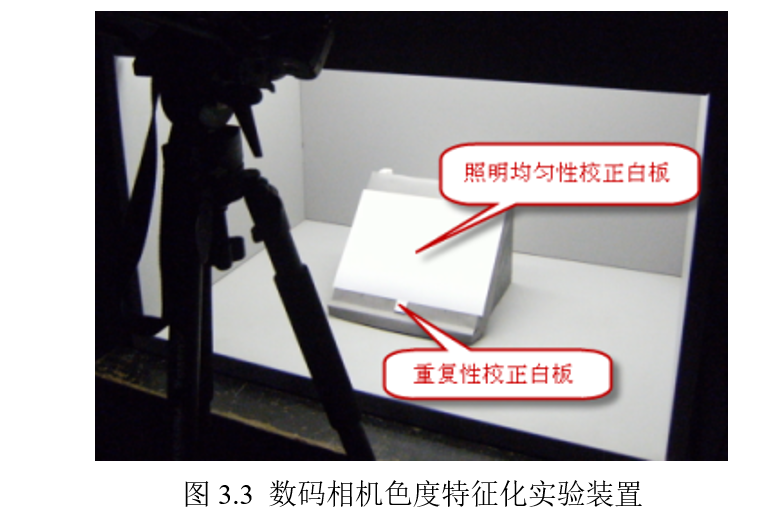

从图 3.3 可以看出，灯箱中的照明光源都在顶部，使得在 45° 支架斜面上的被摄对象从上往下光照依次减弱。另外，由于数码相机及光源照明不可避免地存在一定的波动性，使同一个对象在不同时间所拍摄得到彩色图像的颜色可能不一致。

为了降低上述两个因素对数码相机色度特性化精度的影响，本研究设计两个白板分别对光源的照明均匀性和重复性进行校正，两个白板及其摆放位置如图 3.3 所示，其中重复性校正白板在整个拍摄过程中始终固定在相机视场的下方。

在对色卡拍摄前，首先获取照明均匀性校正白板的图像，而重复性校正白板则与所有对象同时拍摄。照明均匀性校正计算方法为：

$$d_{k,(i,j)}^* = d_{k,(i,j)} \frac{\bar{A}_{k,ref}}{A_{k,(i,j)}} \quad (3.16)$$

式中，$k (k=R, G, B)$ 表示通道类型，$d_{k,(i,j)}$ 和 $d_{k,(i,j)}^*$ 分别表示目标图像在(i, j)像素位置对应的 k 通道在校正前后的驱动值，$\bar{A}_{k,ref}$ 表示照明均匀性校正白板图像中心区域对应的 k 通道平均驱动值，$A_{k,(i,j)}$ 则为照明均匀性校正白板图像在(i, j)像素位置的 k 通道驱动值。

类似于照明均匀性校正方法，重复性校正方法的计算公式为：

$$d_{k,(i,j)}^* = d_{k,(i,j)} \frac{B_{k,ref}}{B_k} \quad (3.17)$$

式中，$d_{k,(i,j)}^*$ 表示目标图像经重复性校正后在(i, j)像素位置对应的 k 通道驱动值，$B_{k,ref}$ 表示与照明均匀性校正白板同时拍摄的重复性校正白板中心区域对应的 k 通道平均驱动值，$B_k$ 表示与目标图像同时拍摄的重复性校正白板中心区域对应的 k 通道平均驱动值。

##### (2) 数码相机非线性变换对色度特性化精度的影响

在对数码相机的色度特性化中，已有研究结果表明 $3 \times 11$ 多项式模型的颜色预测精度较高，因此分别采用基于 $3 \times 11$ 多项式自适应模型对**单阶段**和**双阶段**模型实现数码相机的色度特性化，由此评价非线性变换的考虑与否对模型预测精度的影响。

对于**双阶段**模型中数码相机 R、G 和 B 通道**驱动值**与其对应的成像器件响应值之间的非线性拟合方程为：

$$
\begin{cases}
L = a_r + a_1 r + a_2 r^2 \\
L = b_r + b_1 g + b_2 g^2 \\
L = c_r + c_1 b + c_2 b^2
\end{cases}
\quad (3.18)
$$

式中，L 为归一化亮度值；ai、bi、ci (i=0, 1, 2)为模型参数。将 12 个灰色块对应的归一化**驱动值**及亮度值分别代入式(3.18)，用最小二乘法即可得到非线性变换模型参数。

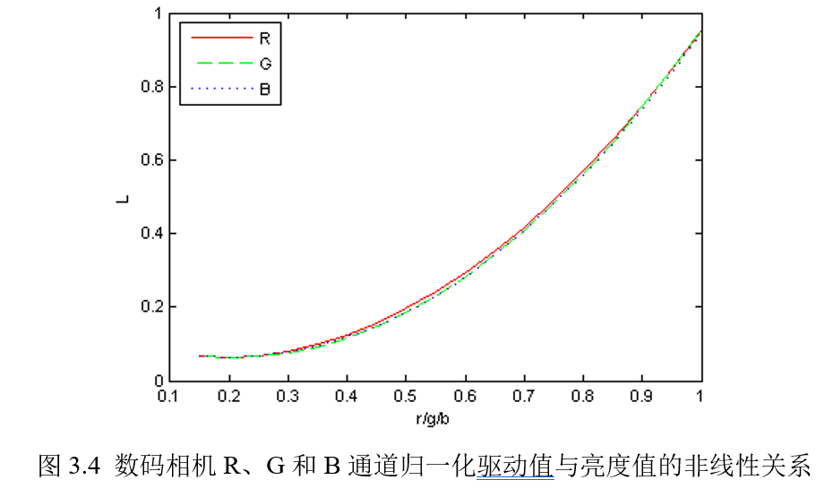

图 3.5 和图 3.6 分别给出了单阶段和双阶段自适应模型在不同局部训练样本数目时的检验样本预测精度，其中点画线、虚线和实线分别表示所有检验样本的最小、平均和最大 CIELAB 色差。可以看出局部训练样本数目的选择对**单阶段**和**双阶段**自适应模型的预测精度都有较大影响，但总体上**单阶段**模型的预测精度高于**双阶段**模型。

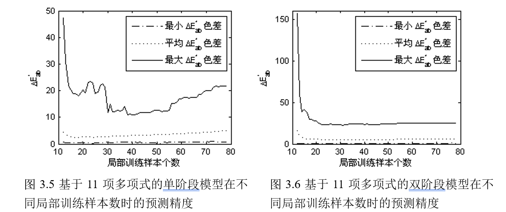

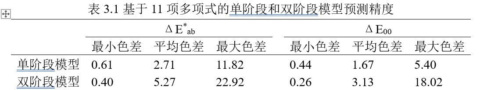

##### (3) 多项式项数及样本介质对特性化精度的影响

在基于多项式的色度特性化模型中，多项式项数及样本介质对模型的预测精度均有较大影响。由上述分析结果可知，单阶段自适应色度特性化模型的预测精度明显高于**双阶段**自适应模型，因此这里重点考察**单阶段**自适应模型受多项式项数及样本介质的影响。

式(3.14)所列出的五种多项式是目前公认的预测精度较高的多项式模型，故重点分析基于这五种多项式的单阶段自适应模型的预测精度。

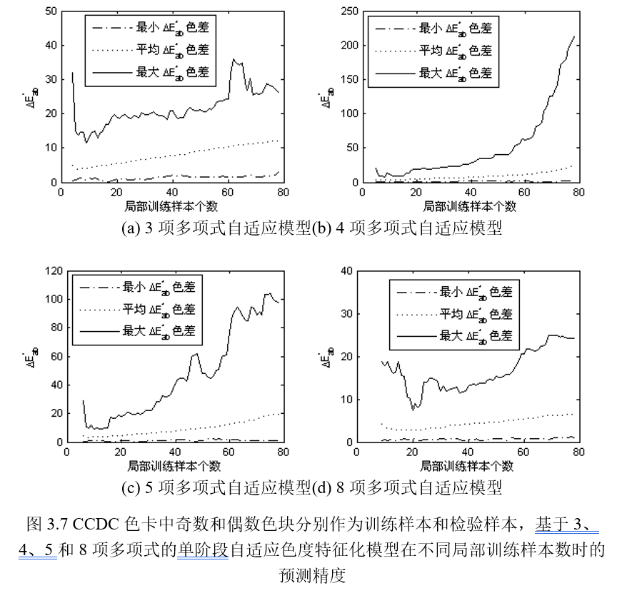

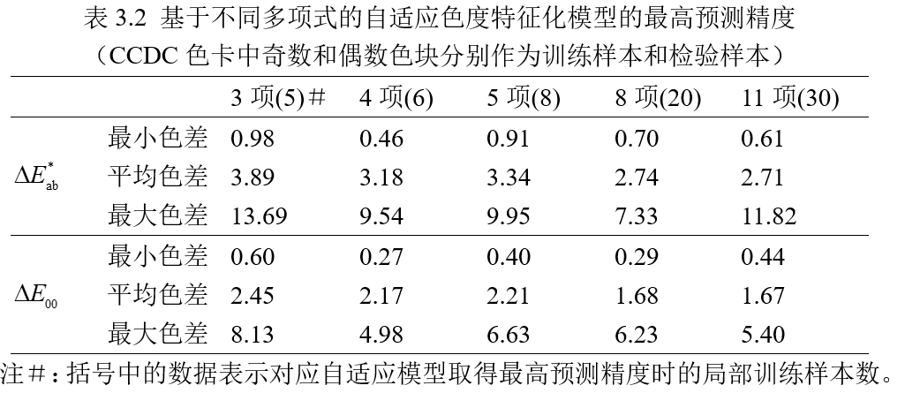
    
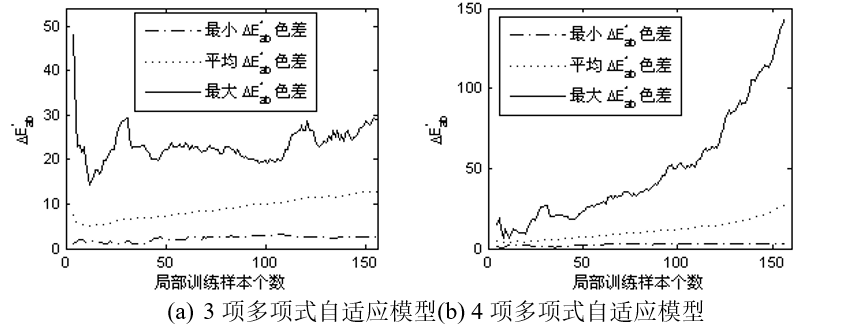
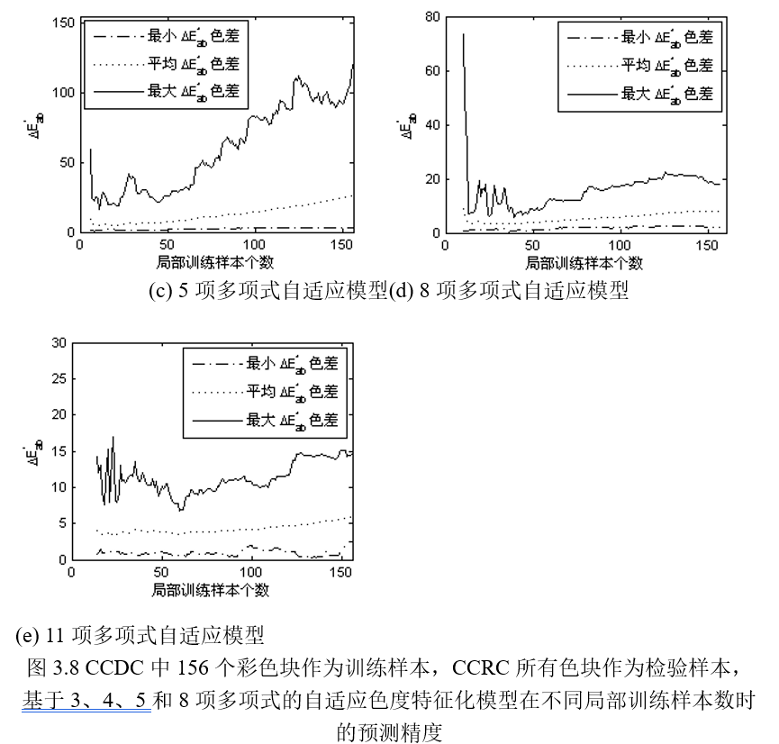

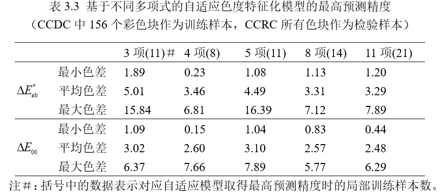

对于数码相机，我们的研究首先分析了其获取彩色图像的基本原理，具体讨论了基于多项式模型的数码相机色度特性化方法，并由此对这一模型做了进一步改进，提出了自适应的色度特性化方法。

### 其他相关讨论

本研究对数码相机的设置方法以及照明均匀性和重复性的校正方法进行了探讨。在标准灯箱中通过对标准色卡拍摄的方式实现了普通商用数码相机的色度特性化，并详细分析和讨论了自适应色度特性化模型中非线性变换步骤、不同的局部训练样本数、多项式项数及介质不同等因素对特征化精度的影响。

扫描仪成像原理与数码相机类似，其区别在于扫描仪的照明光源是固定不变的，而数码相机的照明光源是自然光；扫描仪的成像对象一般是印刷品，而数码相机成像的对象是自然景物。因此数码相机的色度特性化技术与扫描仪具有一定的类似性。目前，比较常用的扫描仪色度特性化方法是采用美国国家标准学会（ANSI, American national standards institute）的 IT8.7/2 标准色卡或者其它标准色卡作为色靶，通过**灰平衡校正**和多项式回归技术或者神经网络训练获得设备色化模型结构和参数，实现设备的色度特性化。

对于数字图像设备的颜色特性化，另外一种比较实用的色度特性化方法为神经网络技术。一般无论是在颜色获取或是颜色再现设备都不是理想的线性系统，并且有些设备因为设备品质、使用时间和环境影响等因素，输入输出关系属于复杂的三维空间非线性映射，而神经网络具有很强的非线性映射能力，因此许多研究者尝试将神经网络技术应用于颜色设备特性化的研究，并取得了很好的效果。