**目录**

### 学习目标

* 介绍用于打印机、打样机和印刷机的色彩管理。
* 定义不同类型的特性文件，包括自定义、通用和流程特性文件。
* 描述打印机特性文件制作过程中的校准和线性化。
* 解释用于CMYK系统的G7校准方法。
* 描述常见的打印机测试图表，如IT8.7/4和ECI 2002。
* 探讨参考印刷条件，如GRACoL, SWOP, FOGRA, CRPC。
* 描述“按数字印刷”的流程。
* 解释渲染意图在印刷应用中的作用。
* 描述设备链接特性文件及其工作流程的用途。

## 8.1 引言

本章描述了为多种不同类型的打印流程进行色彩管理所需的特性文件和处理过程。ICC为输出设备定义了一个特性文件类别，该类别涵盖了从桌面设备、喷墨打样机、数码静电印刷系统、大幅面喷墨系统到商业印刷机的各种设备。在ICC特性文件的层面上，这些设备都被同等对待，但在实际操作中，我们发现打印机、打样机和印刷机在功能上差异巨大，因此有必要为每个打印机类别分别考虑色彩管理的不同方面，这也是本章内容如此详尽的原因。

根据所使用的打印系统，我们可以考虑制作一个自定义特性文件，或者使用制造商提供的通用特性文件，也可以采用一个标准特性文件。本章将详细描述每种方法以及如何使用它们。

与所有特性文件制作过程一样，为打印机制作特性文件同样包含3C原则。对于印刷流程而言，**校准**(calibrating)设备以使其进入一个稳定、可重复的状态尤为重要。本章描述了一系列适用于喷墨打印机、数码印刷机和胶印机的校准与线性化技术。

打印机特性文件制作的一个主要部分是**特性化（characterization）**，这需要通过打印和测量一张测试图表来完成。有多种图表可供选择，包括IT8.7/4或ECI 2002图表。本章将探讨一系列相关问题，例如图表上的色块数量、如何以“无色彩管理”的方式打印图表，以及如何对图表测量值进行平均。在特性文件生成期间，还需要就黑版生成和查找表大小做出选择。

**转换（Conversion）**，即应用一个特性文件，可以在一个RIP（光栅图像处理器）或像Adobe Photoshop这样的应用软件中完成。

在第一章中，我们描述了三种类型的特性文件——自定义、通用和标准。在本章中，我们将详细探讨制作一个**自定义**打印机特性文件的过程。此外，本章还有一个关于使用标准特性文件的详尽章节，其形式是一种参考印刷条件。目前有一种趋势是使用通用的印刷条件，称为**参考印刷条件**，例如北美的GRACoL, SWOP, 和 CRPC，以及欧洲的FOGRA51。为胶印机上每一种略有不同的印刷条件都制作一个自定义特性文件，这在实践中是不切实际的，我们发现用户并不想为些微的差异而持有一大堆特性文件。本章描述了使用参考印刷条件来管理印前和印刷工作流程的流程。

与参考印刷条件相结合，色彩管理的另一个趋势是使用一种称为“**按数字印刷**”的流程。过去那种通过视觉匹配实体打样稿的老式方法，已被基于数值、基于测量的印刷和打样所取代。如今，所有印刷和打样领域的色彩管理都是“按数字”完成的，这里的“数字”指的是所选参考印刷条件的L\*a\*b\*值。

通常，一张数码相机图像比大多数印刷流程能再现的颜色要多，色域也更广。印刷系统通常存在许多超出其色域范围的颜色。色域问题通过渲染意图来处理。本章为ICC官方的四种渲染意图——感知、相对比色、绝对比色和饱和度——提供了专门的解释。

本章最后探讨了一种有用的特性文件类别，称为设备链接特性文件，并描述了在印刷中可用于流程控制的一些选项。

## 8.2 打印机特性文件制作的3C原则

任何设备在成为色彩管理工作流程的一部分之前，都必须拥有一个特性文件。我们来思考一下制作一个自定义打印机特性文件的过程，它同样由色彩管理的3C原则构成——校准、特性化和转换。图8.1概述了自定义打印机特性文件的制作流程。要制作打印机特性文件，您需要先**校准**设备，然后通过打印和测量测试图表，并使用特性文件制作软件来**特性化**该设备。最后，通过一个RIP（光栅图像处理器）、色彩工作流程或像Photoshop这样的应用软件，来使用该特性文件**转换**图像数据。

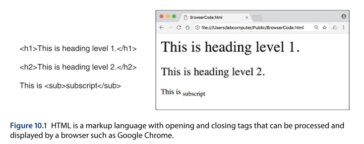

## 8.3 喷墨系统的校准

喷墨系统，例如打印机、打样机和大幅面系统，拥有一系列的校准步骤，这些步骤旨在创建一个性能更稳定、表现更可预测的打印流程，以便在此基础上进行后续的色彩管理。本节我们将探讨墨量限制、油墨挂钩和墨水拆分这几个概念。

### 8.3.1 墨量限制

总区域覆盖率（Total area coverage, TAC）或总墨量限制（total ink limit, TIL）是通过将C-M-Y-K的网点百分比值相加得出的。因此，一个CMYK打印流程可能的最大值是100%C + 100%M + 100%Y + 100%K = 400%。

墨量限制可以应用于所有打印系统，在喷墨打印中，它的作用是降低喷墨量，以防止在承印物上出现墨水淤积和纸张起皱。墨量限制是在喷墨系统的**校准**阶段应用的，它将不同通道的最大墨水输出量降低到一个较低的数值，这个数值对每个通道可能都不同，通常在50–80%之间，具体取决于油墨和介质类型。

介质类型是决定如何设置墨量限制的主要因素之一。例如，与其它介质类型相比，更高质量的涂层照片纸可以承载更多的墨水。打印分辨率设置（1440或2880 dpi）也是决定墨水负载量的一个重要因素。

油墨覆盖率目标靶标是确定最佳总油墨覆盖率的一种方法，如图8.2a所示。该图表显示了在特定黑色水平下，CMY油墨不断增加的量。通常，用户会选择一个恰好变得难以分辨相邻色块差异的值。

在确定了最佳墨量限制设置后，就可以将其输入到RIP软件中，一个来自ColorBurst的示例对话框如图8.2b所示。

请注意，墨量限制设置是校准过程的一部分，不应再被更改。在一个特性文件制作完成后再更改墨量限制，会改变设备的行为，并使打印机特性文件失效。

### 8.3.2 油墨挂钩

喷墨油墨会表现出**油墨挂钩（ink hooking）**的现象，即油墨在浓度较高时其色相会发生改变。为了分析油墨挂钩，我们可以测量打印和测量CMYK颜色渐变色带后产生的L\*a\*b\*值，如图8.3所示。在此图中我们看到，颜色渐变在某个区域内是线性的，然后在渐变的较暗端发生弯曲和偏离。我们以品红色渐变为例，它向右“弯钩”，变得更黄了。

理论上，如果这种弯钩现象是测量数据的一部分，那么一个ICC特性文件可以容纳这种行为。但在实践中，将这类数据呈现给ICC特性文件制作程序，可能会导致不准确的结果。

值得注意的是，品红色渐变的弯钩在改变色相的同时，也确实在继续扩展，从而增加了系统的色域。这意味着，降低墨量限制以遏制弯钩现象，可能会减小设备的色域。用户需要做出判断，是希望将颜色渐变限制在仅产生线性响应的值，还是寻求绝对最大的色域范围并接受弯钩行为。所以我们看到，在油墨挂钩和色域范围之间存在一种权衡。

RIP和特性文件制作软件为喷墨打印机提供了墨量限制的选项，这在进行特性化图表打印之前，就解决了油墨挂钩的问题。

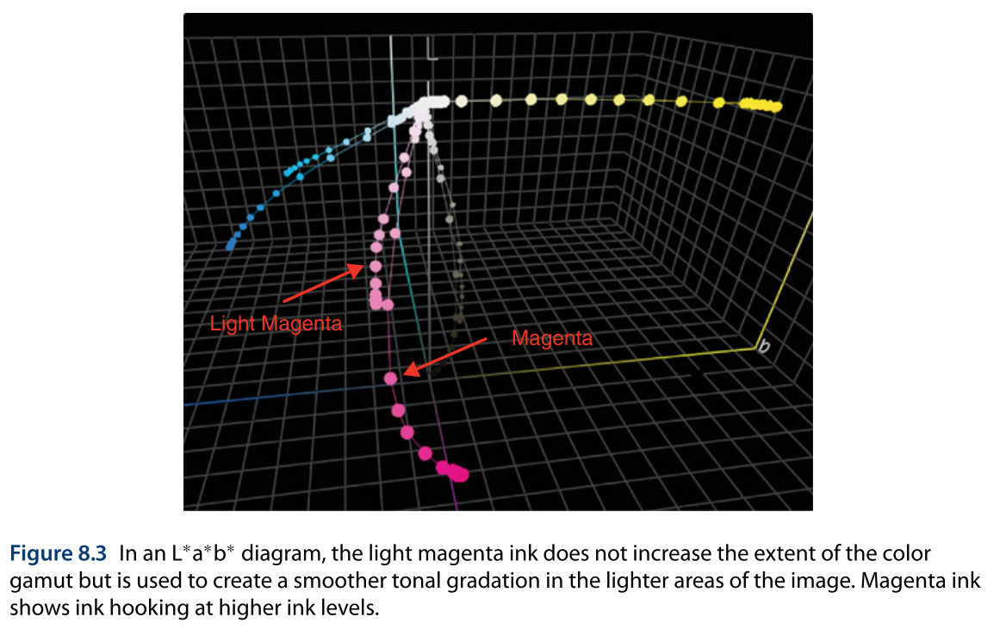

### 8.3.3 墨水拆分

大多数喷墨设备会为每个通道使用两种墨水，例如，一种淡品红色（LM）和一种普通品红色（M），如图8.4a所示。淡品红色和普通品红色之间的墨水拆分，可以在RIP的一个对话框中进行控制，如图8.4b所示。在此图中我们看到，淡品红墨水的使用量增加，直到中间调（大约50%）附近，然后其用量趋于平稳，最终逐渐减少。从中间调开始，普通品红墨水开始增加，并在图像的较暗色调中被越来越多地使用。通常，淡墨水用于高光区域，并在中间调与普通墨水混合，直至阴影区域。图8.4c展示了一张包含淡品红墨水（背景）和普通品红墨水（前景）的打印区域。

在何时以及如何进行墨水拆分，需要在喷墨特性文件制作的校准阶段就确定好。在一个特性文件被制作完成后，这个控制选项不应再被更改。

在考虑拥有多种墨水的喷墨打印机的色彩能力时，人们很容易得出一个结论：“墨盒越多=色域越广”。重要的是要注意，与普遍的误解相反，**淡墨水并不会增加色域范围**。如果一台打印机有橙色、绿色或紫色墨水，这些墨水确实有望增加打印机色域，然而，淡墨水是用于图像的较亮区域，以改善这些区域的色调，而不会促成一个更大的色域体积。

为了评估淡墨水所产生的颜色，我们可以对一台喷墨打印机的淡墨水和普通墨水进行三维的L\*a\*b\*分析，如图8.3所示。在L\*a\*b\*图表中，淡青色、淡品红色和淡黑色墨水的色度都比普通墨水要小。从这个图中我们可以清楚地看到，淡墨水没有推动或扩展色域，因此没有增加系统的色域范围。（请注意，喷墨打印机从来没有淡黄色，因为黄色本身就是一种很浅的颜色。）

从图8.3中可以有趣地注意到，被稀释的淡墨水与普通墨水相比，其色相略有不同；这种色相差异是客观存在的，但无需担忧，因为它会被ICC特性文件的校正作用所完全补偿。

## 8.4 数码印刷机的校准

数码印刷机的特点是采用静电印刷（xerographic）工艺，该工艺使用碳粉颗粒、光导鼓、电晕充电丝、转印带和一个高温定影过程。一台数码印刷机的打印速度通常为每分钟70–100页（ppm），并且由一个称为“数字前端”（digital front end, DFE）或控制器的设备来控制。所有配备了DFE/控制器的数码印刷机，都能够完全支持ICC色彩管理。

数码印刷机最主要的校准过程被称为**纸张校准**，如图8.5所示。纸张校准通常涉及打印和测量CMYK颜色渐变条。

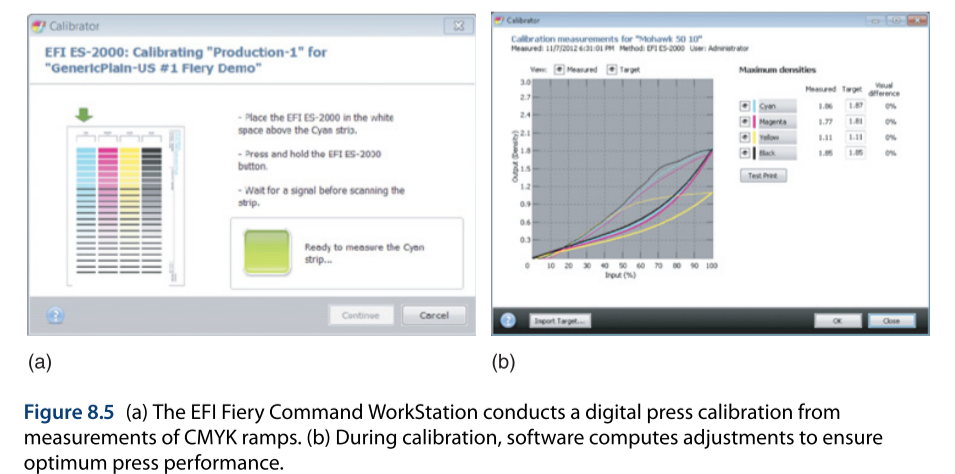

在多种情况下，可能需要对数码印刷机进行校准，例如环境发生变化后、更换零件等机械变动后，或者最常见的，为了适应不同纸张类型带来的影响。在数码印刷中，校准也被用作一种流程控制手段，以调整印刷机的响应并使其恢复到一个已知的稳定状态。

数码印刷机的校准通常由DFE软件来引导，如图8.5b所示。操作员通常会打印并测量CMYK颜色渐变条。根据数码印刷机的型号和配置，校准用的靶标可以使用分光光度计来测量。如果数码印刷机自带扫描仪，则靶标也可以由该扫描仪“测量”。用于数码印刷机校准的常见仪器是X-Rite i1Pro2分光光度计，或其OEM版本，例如我们在前一章图4.12i中展示过的EFI ES-2000。

在校准过程中，软件会计算并应用校正，以将打印流程恢复到先前确定的状态。简单来说，如果机器的状态发生了漂移，校准就能把它拉回到我们原来的基准线上。如果输出品的密度低于预期、打印品出现色偏，或出现任何其他不希望的颜色或成像瑕疵（例如高光或暗部细节堵塞、颜色不均匀），就应该进行校准。此外，数码印刷机还会利用关于纸张的信息来调整其内部操作参数，例如定影器的温度。

校准文件为选定的输出特性文件提供了基础。事实上，如果不参照校准文件，是无法进行打印的，正如在EFI Command WorkStation DFE界面中所展示的，如图8.6所示。请注意，每一个图像路径在送往印刷机之前，都必须经过校准阶段。

## 8.5 胶印的校准

在胶印平版印刷中，有许多印刷工艺的方面必须在校准过程中被了解和控制。胶印是一种复杂的模拟印刷过程，有许多因素会影响印刷颜色，例如印刷油墨、纸张、印刷机耗材（如润版液、橡皮布、滚筒）、印版、计算机直接制版机（computer-to-plate）的设置、印刷机上目标密度和墨键的设置、墨序、油墨叠印等等。

一个印刷校准系统所需要的是，能够建立一个基准设置，一种快速简便的方法来监控它，以及一种在印刷机偏离其校准状态时使其恢复的方法。市面上有许多校准方法，它们各有不同的理念和工作方式，但它们的共同点是，都为后续的ICC色彩管理创造了更好的一致性，并提供了一个良好的起点。

ProcessStandard Offset (PSO) 程序是由Fogra与德国印刷和媒体工业联合会（BVDM）合作开发的。它是一个面向行业的、用于创建印刷品的标准化程序描述。Idealliance G7流程是另一种校准方法，此外还有其他校准方法，包括来自海德堡的灰平衡优化和System Brunner，在欧洲胶印中被广泛使用。

我们现在以G7流程作为胶印校准流程的一个例子。

### 8.5.1 G7校准

G7校准流程可以应用于胶印以及其他CMYK印刷流程。G7基于**灰平衡**。我们对中性色中的色偏非常敏感，因此通过平衡中性色或灰色，我们可以创建一个“灰平衡”的图像。一句暗房摄影时代的古老谚语说，“先把黑白搞定”，这句话点出了任何色彩校正中消除中性色色偏的重要性。

长久以来，人们都知道要用胶印油墨创建一个中性色，需要使用不等量的CMY。对于一个能产生中性中间调灰色的CMY混合，有一个“50, 40, 40”的经验法则。每一种印刷油墨组都需要一个不同的青色:品红:黄色的比例来创建一个中性灰。确定您特定印刷系统的这些相对比例，就是G7的基本原理。

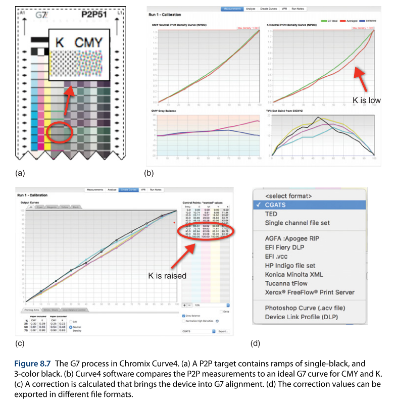

G7是基于在CMY构成的黑色和仅用K构成的黑色之间建立一种关系，这种关系基于所用的纸张以及该印刷流程能达到的最高密度。请看图8.7，它展示了G7校准流程的步骤。

(a) 首先，一个名为P2P的目标靶标被打印在印刷机上。P2P代表“press-to-proof”（从印刷到打样）。P2P靶标由两条灰色渐变带组成，一条包含青、品红和黄，另一条只包含黑色油墨。P2P靶标有不同的版本号和格式，厂商可能会将P2P色块整合进他们自己的专有靶标中，或创建他们自己版本的靶标。

(b) P2P靶标被打印出来后，使用指定的软件进行测量。其中一个分析软件的例子是Chromix Curve4。Curve4会分析CMY和K的响应，并显示设备的当前响应与理想G7曲线的对比。理想的G7校准曲线如图中所示，CMY和K曲线应该近似重合，以达到G7色调曲线的形状。在本例中，CMY曲线是OK的，但K通道需要进行校正。

(c) 我们在这个例子中看到，印刷机中的黑色通道太浅，无法达到G7的色调响应。Curve4程序计算出一个校正，使得CMY值基本保持不变，但黑色通道被增加了。原来K值为70%的地方，校正查找表现建议改为77%，80%则变为85%，以此类推。

(d) 这个校正查找表旨在调整打印出的渐变，使其更好地近似G-7曲线，从而使打印系统达到“G7校准”状态。校正查找表可以被导出，并通过一个RIP、制版机、Photoshop或其他工作流程系统来应用，也许是以一个CGATS文本文件的形式。

在流程的最后部分，校正可以被应用到打印系统中，然后P2P靶标可以被重新打印和重新测量，以验证新的结果。要确认您是否满足G7校准条件，您可以让Curve4软件进行“验证”，或者一个熟练的用户可以自己使用已发布的G7通过/失败标准来进行数学计算。在官方认证流程中，重新打印的P2P靶标可能会被送到一个指定的实验室进行独立的测量和验证。

### 8.5.2 共享中性外观 vs. 完全色彩匹配

G7曲线是一种特定的、被选定的色调曲线形状，它在一个名为TR 015的公共领域免费技术报告中被描述。该文件允许制造商在其应用程序和系统中实施和生成G7响应。

值得注意的是，G7曲线是根据提供的测量数据，为每个特定的打印流程动态创建的。虽然曲线形状在TR 015中被定义，但曲线的顶部和底部是“浮动”的，它们始于被打印样本的白点，并终于最暗的实地油墨色块。正因为如此，G7流程在低端（亮部）作为所用纸张类型亮度和颜色的一个相对函数而工作，而在高端（暗部）则不会降低打印流程的密度。

由于G7校准过程是基于灰平衡的视觉属性，我们看到，当相同的图像在应用了G7流程的相似打印系统上（例如，两台使用相同油墨、纸张并按相同印刷条件操作的胶印机）打印时，可以呈现出一种共享的中性外观。在这种情况下，应用G7校准流程可以创造出相似的外观。在共享中性外观的情况下，图像可能不是一个精确的颜色匹配，但它们在高光、中间调和阴影部分创造了相同的印象，如图8.8所示。我们可以说，G7校准可以在不同的打印流程中，相对于每个流程的承印物和可用的实地油墨密度，创造出相似的中性外观。

大多数情况下，当使用不同的打印流程时，为了在简单色调之外的所有颜色方面都获得完全匹配，我们必须考虑基于ICC特性文件的色彩管理。**G7是一个校准程序**，与其他校准程序一样，它通常之后会跟随着ICC特性文件的应用，这遵循了色彩管理的3C原则——校准、特性化和转换。

### 8.6 打印机测试图表

我们已经讨论了3C原则中的校准，接下来便是**特性化（characterization）**，通常也称为“profiling”。

特性化，简单来说，就是通过打印并测量一张标准的测试图表，来摸清一台打印机的“脾气”和“习性”。测试图表是一份数字文件（通常是TIFF格式），包含了成百上千个颜色已知、数值固定的色块。

理论上，最准确的方式是把打印机能打印的所有CMYK颜色组合都打出来测量一遍，但这将产生数以百万计的色块，耗时数周，完全不现实。因此，我们选择打印一个有代表性的“样本集”，也就是测试图表。软件通过测量这个样本集，就能建立一个能模拟打印机整体行为的数学模型，并以此为基础，生成用于色彩转换的查找表。最终特性文件的质量，很大程度上取决于这个模型的精准程度。

市面上有多种测试图表可供选择，下面我们来看看最常用的几种。

### 8.6.1 常用的打印机测试图表

图8.9展示了几种用于不同特性文件制作流程的图表。其中，IT8.7/1和IT8.7/2是用于扫描仪的，我们在此略过，主要关注用于打印机的图表。

* **(c) IT8.7/3:** 这是一个**已过时**的CMYK特性化图表。它包含一个有182个色块的基础部分，以及一个扩展到928个色块的完整版本。由于已被IT8.7/4全面取代，现在已不推荐使用。

* **(d) IT8.7/4:** 这是**当前行业的标准**打印机测试图表，包含1617个由其CMYK值定义的色块。它是IT8.7/3的升级版，增加了许多数据点，对色彩空间进行了更好的采样，特别是在高光和阴影区域的数据点更为丰富，并且新增了一些尤其适用于包装行业的色块。IT8.7/4完全兼容IT8.7/3，许多程序能够直接从IT8.7/4的数据中提取出IT8.7/3的数据集。该图表被广泛用于静电、大幅面喷墨、胶印、凹印和柔印等所有印刷流程，是一个国际标准（ISO 12642）。

* **(e) ECI 2002:** 这是IT8.7/3图表的另一个替代选择。ECI（欧洲色彩促进会）的测试图表包含1485个色块，并且在IT8.7/3和IT8.7/4的基础上做了一些改进。许多供应商都支持并推荐使用ECI 2002作为打印机特性文件制作的靶标，它可用于所有常规和数码CMYK印刷流程。

* **(f) 专有RGB图表:** 偶尔，喷墨打印机在用于照片打印等场景时，可能会被当作RGB设备来处理。在这种情况下，没有标准的RGB测试图表，大多数RGB打印机倾向于使用专有图表，即由特性文件制作软件自行描述图表中的色块数量和所需参考文件。虽然这种方式可行，但使用专有图表会限制与其他控制条带的互操作性，也无法方便地报告色差（ΔE）。

此外，在涉及橙色、绿色、紫色等额外着色剂的广色域印刷领域，目前还没有标准化的CMYK+OGV图表，因此这类图表通常也是专有的。

值得一提的是，这些图表的设计思路各不相同。扫描仪图表中的色块通常是在L\*a\*b\*空间中均匀分布的，以更好地对应人类的视觉感知。而打印机图表（如IT8.7/3和IT8.7/4）的色值，则可能是在CMYK空间中以等量递增的方式设计的，这在L\*a\*b\*空间中可能并非均匀分布，但能系统性地覆盖设备的响应范围。

尽管新的应用和讨论总在不断涌现，但时至今日，**IT8.7/4图表得到了几乎所有系统的支持，在可预见的未来，它仍将是色彩管理的主要选择。**

### 8.6.2 可视化与随机布局

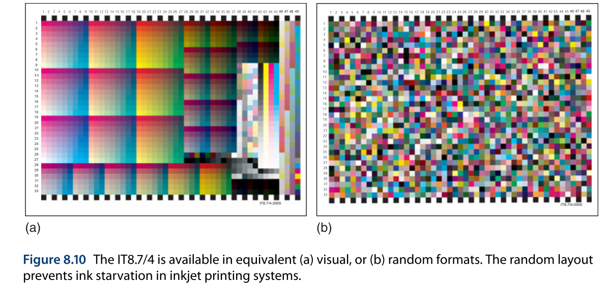

打印机图表通常设计有“可视化”和“随机”两种布局，如图8.10所示。

* **可视化布局 (Visual):** 色块按照逻辑顺序（例如从浅到深的渐变）整齐排列。
* **随机布局 (Random):** 色块的位置被完全打乱。

之所以需要“随机”布局，**主要是为了解决部分打印机（尤其是喷墨打印机）在打印时可能出现的“供墨不足”或“过量喷墨”等问题**。如果在一大片区域内连续打印颜色相近的色块，可能会导致打印机供墨不稳定，从而影响测量结果的准确性。

通过将色块随机打乱排列，整个图表区域内的油墨负载就变得均匀了，从而能更准确地反映打印机的真实性能。

需要注意的是，两种布局的色块数值是完全相同的，改变的只是它们在纸上的位置。而且，“随机”布局并非真的随机，而是经过精心设计的“打乱”布局，每个色块的位置和数值都是预先考虑好的。

随机布局的一个小缺点是，它在视觉上是混乱的，我们无法凭肉眼方便地找到中性灰渐变条或各个颜色的实地色块来进行快速分析。不过，这在实际操作中通常不成问题，因为所有的测量软件都能在测量后，将数据重新排列，并以易于理解的可视化格式显示出来，无论您使用的是哪种布局的测试图表。

### 8.7 打印和测量测试图表

选好测试图表后，下一步就是打印和测量它。打印时必须确保图表尺寸适合您的测量仪器，并且整个打印过程要使用“无色彩管理”模式。下面我们将逐一探讨这些步骤，为制作打印机特性文件的最后阶段做准备。

#### 8.7.1 打印机是RGB, CMYK, 还是半色调模式？

喷墨打印机和打样机等设备，可以按RGB、CMYK或半色调（Halftone）这三种模式进行分类。在RGB和CMYK模式下，图像数据会被交给打印机驱动程序和系统库来完成打印；而在半色调模式下，则由RIP软件完全接管，直至驱动打印头。这三种模式通常在每种打印机上都可用，各有优劣。关键在于，制作特性文件时使用的模式，必须与后续实际打印作业时使用的模式保持一致。

**RGB打印机**

如今，许多喷墨打印机（尤其是面向摄影市场的）都被当作RGB打印机来使用。用户可以直接从任何支持色彩的应用（如Photoshop或Lightroom）打印，无需特殊软件。图像的RGB数据被发送到打印机驱动程序，驱动程序再将其转换为打印机自身的墨水组合并进行打印。打印机的配置是通过驱动程序的对话框完成的，制造商的驱动程序负责“管理”整个打印过程。

也存在一种变体，即商业解决方案不使用打印机驱动，而是调用其底层的RGB打印机库，从而提供更优化的界面和更高的生产力选项，例如ColorBurst Overdrive等产品。

要为此类RGB模式的打印机制作特性文件，我们会使用一张RGB图表，并假定打印机驱动或库的色彩处理过程是一个固定的“静态黑盒”。

**CMYK打印机**

另一种常见的方法，是将喷墨设备视为一台CMYK打印机。印前和打样市场通常使用第三方的RIP软件，向打印机发送CMYK指令。在这种模式下，线性化和校准等过程由用户通过RIP来执行和应用。RIP会管理打印机的剩余流程，包括将墨水拆分到淡色通道，以及使用橙色、绿色等额外墨水。

大多数专业的打样RIP软件，如EFI Fiery XF或ONYX，以及工作流程软件，如柯达Prinergy或艾司科Automation Engine，都是以CMYK模式来驱动打印机的。

要为此类CMYK模式的打印机制作特性文件，我们会使用一张CMYK图表，并同样假定打印机库的色彩处理过程是一个“静态黑盒”。

**半色调模式**

半色调模式是一种“真正的”打印模式。在此模式下，RIP软件会将图像网点化，将墨水拆分到淡/浓通道，将颜色映射到CMYKOG等额外墨水，设定打印分辨率，并直接指挥打印头在纸上喷射不同量的墨水。打印机的所有环节都由RIP软件直接控制。这是一种高级打印模式，可用于创建网点打样或修改打印引擎设置等应用，而这些在其他打印模式下是不允许的。

通常需要第三方RIP软件才能使用此模式。在多数情况下，半色调模式是开发者最后才会添加到“愿望清单”上的选项，并且通常是应客户需求才开发的。尽管如此，要为一个使用了扩展墨水组的打印机进行完整的特性文件制作，半色调模式是唯一正确的方法。

要判断您当前使用的是RGB还是CMYK工作流程，有一个简单的测试方法（图8.12）。如果打印出的上下两行渐变看起来相似，您使用的就是RGB流程；如果下方渐变显得浑浊，那么您的打印流程就假定输入的是CMYK数据。您需要根据您的工作流程、硬件和软件来选择合适的方法，因为不同模式会产生不同的结果。

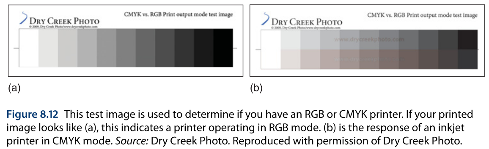

#### 8.7.2 以“无色彩管理”方式打印

大多数特性文件制作软件都允许您直接从程序内部打印测试图表，或者先将图表保存为TIFF文件再自行打印。无论哪种方式，最重要（但并不总是容易做到）的一点是，必须以**“无色彩管理”**的方式来打印。

在打印测试图表时，我们的目标是记录设备**最原始、最默认**的色彩行为。因此，图表打印过程中不能施加任何色彩校正或ICC特性文件。我们需要想办法启用任何校准或基础设置，但除此之外，不应再应用任何“色彩管理”。

要做到这一点，可以使用一些专用工具。例如，macOS自带的ColorSync实用工具，允许以“作为颜色目标打印”的选项来关闭色彩管理（图8.13a）。如果通过RGB打印机驱动打印RGB图表，则需要在相应的对话框中关闭色彩管理（图8.13b）。Adobe Color Printer Utility也允许在Windows或macOS上以无色彩管理的方式打印测试目标。

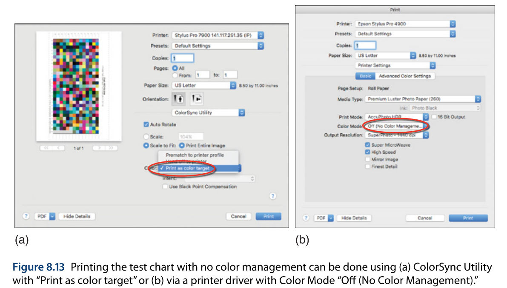

有一个简单的方法可以判断打印时是否应用了色彩管理：用一个放大镜仔细观察任意一个单色色块。一个“干净”的打印色块，应该只包含数字文件中指定的那些着色剂，而不含其他颜色的墨水（图8.14a）。如果在打印过程中我们看到了微量的其他颜色墨水被添加进来，这通常意味着打印时应用了色彩管理（图8.14b）。

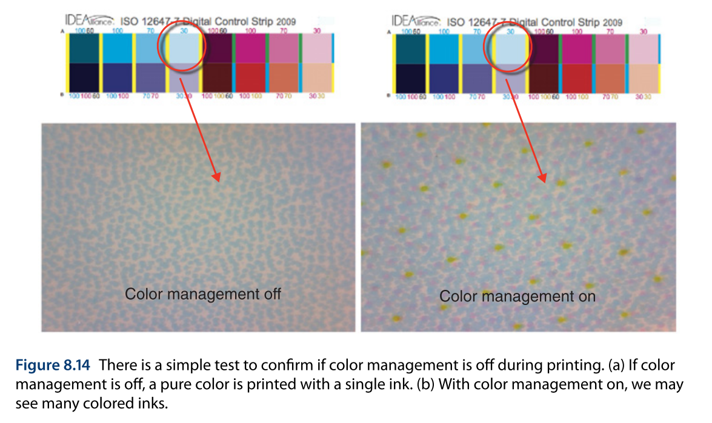

#### 8.7.3 针对不同测量仪器的布局

要获得一个好的特性文件，在测量过程中需要注意许多实际问题。

到目前为止我们描述的所有图表（ECI 2002, IT8.7/4等），都可以被格式化为不同的形状和尺寸，以适应不同的测量仪器。图表的内容通常保持不变，但布局可能会被改变以匹配所选的测量设备。每个测量仪器都需要不同的标记、导线和色块分隔符。通常设备需要定位标记来识别图表的方向和页眉，以便在自动读取器中进行机器和图案识别。

图8.15展示了为X-Rite i1Pro2条带读取器、X-Rite i1iO平台和X-Rite i1iSis2自动扫描仪器格式化的IT8.7/4图表。例如，i1Pro2需要在每行的开始和结束处有清晰的区域；i1iO在每页的角落有位置定位器；而i1iSis2 XL则有菱形的对齐导块和1.5英寸的页眉。

当一张图表被打印出来后，有几件事需要注意。大多数图表会有裁切标记或套准标记，用于硬件定位和识别图表边界。必须确认打印机没有裁切掉这些标记，您自己也不应该从打印边界修剪它们。（有经验的用户有时会用记号笔在图表上添加线条或用胶带修复被意外裁切的图表页眉。）

考虑打印图表的物理尺寸也很重要。在打印过程中，不应无意中改变图表的尺寸以适应页面或与其他图像放在一张纸上。每台仪器都有一个最小的色块尺寸要求，如果图像尺寸过小，可能会导致读取图表时出现问题。

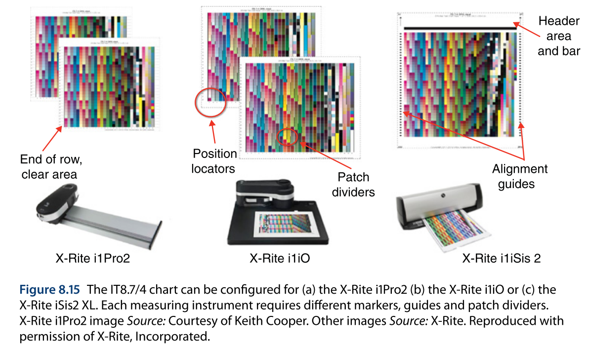

#### 8.7.4 白色背衬

有许多因素会影响图表的准确读取。根据您的情况，必要的预防措施会有所不同。例如，从喷墨打印机打印出的图表应在测量前让其彻底干燥。其他测量问题可能源于图表不平整、色块上有灰尘斑点、色块被弄脏、图表未对齐以及图表打印不正确等。

有时，图表可能打印在不够不透明的纸张上，导致背衬的颜色或印在背面的图像会透过来。一个好的做法是只在纸张的一面打印图表，即使实际工作将在纸张的两面打印。在许多情况下，测量时在样本下方放置一或多张未打印的相同纸张会很有帮助。对于一些仪器，您可以选择白色或黑色背衬选项。如今，**白色背衬，或称“相同纸张背衬”**，已成为常规范例。

当读取图表时，大多数软件会在屏幕上显示它期望您测量的色块。一些供应商会对测量数据执行自动检查，例如，数据是否非单调，或者白点色块是否脏了。

#### 8.7.5 检查测量文件

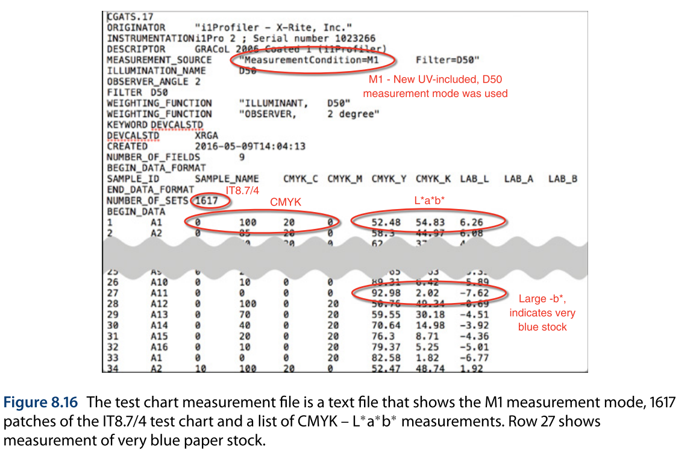

在测试图表被打印和测量之后，可以将测量数据保存为一个文本文件，如图8.16所示。该测量文件是一个ASCII文件，可以用任何文本编辑器打开。我们看到，文件头应指明测量条件，如今推荐的测量模式是M1，它代表一个包含UV的、D50的测量条件。文件头还显示了测量的色块数量为1617个，这表明数据来自一张IT8.7/4图表。

查看测量文件可以确认我们对色彩管理和打印机特性文件制作的理解。测量文件的第一部分是一个CMYK值列表，这些值是发送到打印机的测试图表中的色块值。与每个CMYK值配对的是打印出的颜色的测量值，单位是L\*a\*b\*。一个测量文件也可能包含每个色块的XYZ或光谱数据。

一个特性文件制作应用程序会接收这些CMYK-L\*a\*b\*数据对，建立一个数学模型，填充查找表，并最终创建一个ICC特性文件，以存储供ICC兼容应用程序使用的查找表。

在测量文件中，找到实地油墨密度是很有用的，例如CMYK值为100, 0, 0, 0代表100%的青色。也可以找到没有油墨的白点，CMYK值为0, 0, 0, 0，它代表对承印物的测量，通常被称为“纸白”。在这个例子中，白点有一个很大的负b\*值，这表明纸张可能含有荧光增白剂。

通常可以保存测量数据，然后继续进行特性文件生成。保留测量数据的一个原因是，如果您想用不同的黑版生成设置重新创建特性文件。如果测量文件以标准格式保存，它通常可以在另一个程序中使用，以查看不同供应商的比较，或者可以用像Chromix ColorThink Pro这样的工具来分析设备的色域。

#### 8.7.6 平均化测量文件

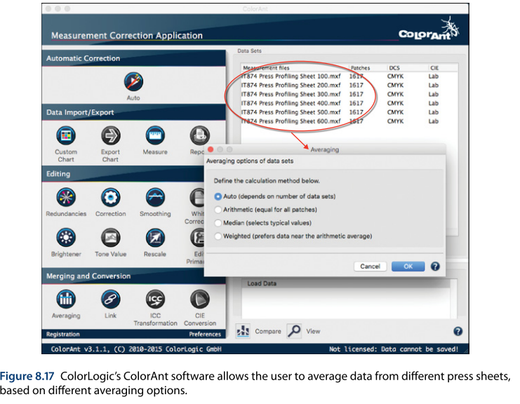

印刷流程有许多活动部件，因此在一次印刷过程中常常会表现出变异性，例如第一张和最后一张印张之间的差异，以及在一张印张内从左到右和从上到下的变化。在所有印刷系统中都可能出现变化，包括静电印刷、大幅面喷墨，以及传统的胶印、柔印和凹印。

通过打印和测量任意数量的测试图表并对结果进行平均，可以将在打印过程中出现的任何颜色变化最小化。像ColorLogic的ColorAnt这样的软件提供了一个清晰的界面，带有复杂的平均选项，包括算术平均、中位数和加权平均，如图8.17所示。通过平均测量文件，可以为现实生活中的打印中不可避免的变化留出一些余地。

## 8.8 制作一个打印机特性文件

当一个打印系统经过了校准和线性化，测试图表也已打印完成，并且多次测量的结果也已平均化之后，我们终于准备好制作一个打印机特性文件了。

制作打印机特性文件时，用户需要在特性文件制作程序中遵循一步步的指引。根据所使用的程序，用户需要做出一些选择。最常遇到的选项是**GCR/UCR/黑版通道设置**，以及一个**质量设置**。下面我们来看看这些设置的作用。

### 8.8.1 黑版生成

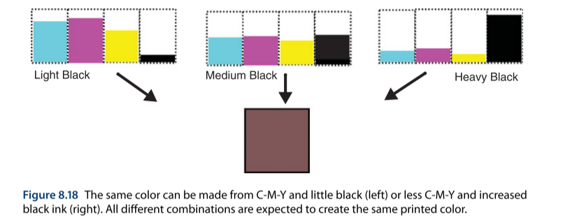

输出特性文件生成的一个主要部分，涉及到一个关于黑版生成的设置，它包含了被称为底色去除（Under Color Removal, UCR）和灰色成分替代（Gray Component Replacement, GCR）的工艺，以及节省油墨的目的。所有供应商都为黑版生成提供了一个默认设置，所以对于一般要求，可以直接使用默认值。

要理解这个设置及其对打印结果的影响，我们需要更详细地思考黑版生成的过程。理论上，青、品红、黄这三种油墨各自控制光谱的三分之一，因此仅用这三者的混合就可能再现所有颜色。然而，大多数印刷油墨含有的颜料或染料并不具备完美的吸收光谱，它们会吸收一些不希望的次要颜色。因此，当青、品红、黄三色混合在一起时，它们产生的是一种**浑浊的棕色**，而不是一个清爽、干净的黑色。在传统印刷中，第四种颜色是黑色，尽管理论上它并非必需，但在实践中，出于色彩表现和商业上的优势，它被广泛使用。

正因为黑色并非绝对必需，它的使用就提供了一定程度的“冗余”。我们可以用大量的青、品红、黄和很少的黑色来创建同一个颜色，也可以用较少的青、品红、黄和更多的黑色来创建它，如图8.18所示。

GCR/UCR流程就是用来减少三原色油墨（青、品红、黄）的用量，并用等量的黑色油墨来替代它们。

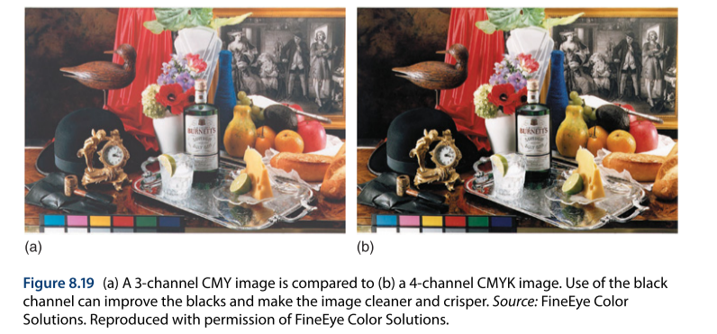

使用黑色成分的优势如图8.19所示，它将一个三色图像与一个四色图像进行了对比。请注意，四色图像阴影部分的黑色更清爽、更干净，而三色图像的黑色则显得暗淡、肮脏。同时也要注意，四色图像的整体图像质量和色彩再现效果看起来更好。

使用黑色替代有许多优点。首先，使用较少量的彩色油墨能让印刷机运行更稳定，因为彩色油墨用量少了，即使印刷密度稍有漂移，其影响也会被最小化。其次，使用黑色油墨能减少总墨量，这有助于缩短干燥时间，并使得在新闻纸这类承印物上印刷成为可能。最后，使用更便宜的黑色油墨来代替昂贵的彩色油墨，也降低了印刷成本。

色彩管理软件允许用户选择黑色的使用程度，如图8.20所示。黑版可以被应用在任何含有一些共同灰色成分的彩色区域，或者只应用在中性灰色中。不同的黑版通道策略会改变油墨的构成，但不应影响最终打印图像的颜色。

对黑版生成的控制，也可以通过最大墨量限制来描述。墨量限制被指定为任何像素上CMYK网点值的总和；因此，一个四色流程的理论最大限制是400%的覆盖率。卷筒纸胶印流程尤其容易出现油墨蹭脏，所以其实际限制大约在250%。杂志的SWOP规范限制在300%以下，而新闻纸的SNAP规范则要求200%–220%的油墨覆盖率。

打印机特性文件生成的一个问题是，黑色替代的程度是固定的，并且无法轻易更改。这是因为查找表是在色彩管理软件中使用某个固定的UCR/GCR水平计算出来的。在制作特性文件时，软件会要求用户指定所需的黑量，并据此创建一个特性文件。如果您想更改黑版使用的程度，您必须从测量数据文件重新开始，并使用新的黑版生成参数来重新创建特性文件。

### 8.8.2 特性文件质量

当一个打印机特性文件被制作时，用户需要选择一个质量设置，例如，小、中、大，如图8.20所示。这个设置指的是L\*a\*b\*-到-CMYK和CMYK-到-L\*a\*b\*查找表中的**条目数量**。

一个打印机查找表并不会存储每一个L\*a\*b\*值。如果一个图像像素包含一个L\*a\*b\*值为12, 0, 0，而查找表中只有10, 0, 0和20, 0, 0这两个相邻的值，那么最终的CMYK结果将通过在这两个值之间进行**插值**来“猜测”得出。如果我们减少数值之间的间距，比如说在10, 0, 0和15, 0, 0之间进行插值，那么计算的准确性就会增加。因此，随着我们拥有的数据点越多，插值的准确性（并因此特性文件的准确性）也随之增加。

我们已经花了这么多功夫来校准我们的设备，打印和测量一张测试图表，我们决不能在最后这一步因为选择了一个小尺寸的查找表而前功尽弃。转换的准确性和平滑度的提升，可以用图8.21的图示来表示。

增加查找表中的条目数量可以提高准确性，但也会增加特性文件的体积。每个查找表都与不同的渲染意图一起存储，因此一个输出特性文件的体积可能会达到3MB，这在今天看来并不是一个很大的文件。

如果文件大小不是问题，那么建议使用最大数量的立方体节点。如果文件大小是一个问题，那么可以减小A到B（仅用于打样）查找表的尺寸，但保留用于处理最终图像数据的B到A查找表的完整尺寸。

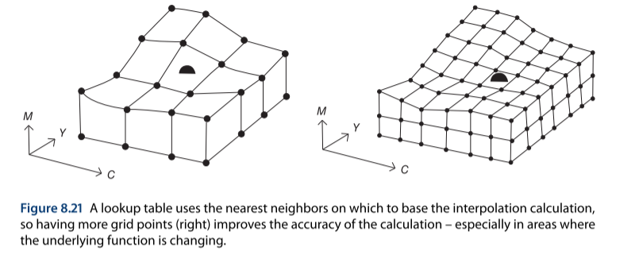