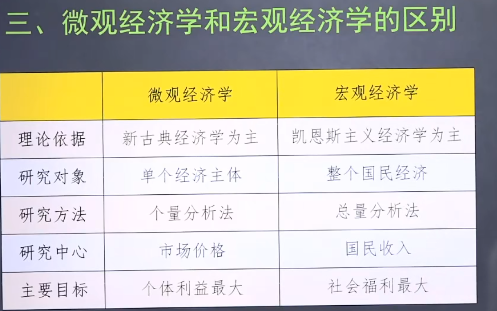

## 经济学引论 二

**微观经济学：**
以单个个体为对象，比如个体、厂商或企业 
> 比如全国**小麦**的生成总量

**微观经济学的三个基本假设**
1. 理性人假设：个人利益最大化
2. 信息**完全**假设 ：信息公开
3. 市场出清：资源充分利用，不存在闲置浪费

**宏观经济学：**
整个国民经济（政府）；研究资源利用

**区别**

**边际分析**

边际可理解为 **增量** 的含义（发生一个微笑的变动）

****现代经济学奠基者：亚当$\cdot$斯密 （17$**$年的）**
代表作：国富论(很nb)

**宏观经济学奠基者：凯恩斯**
也很nb
凯恩斯革命